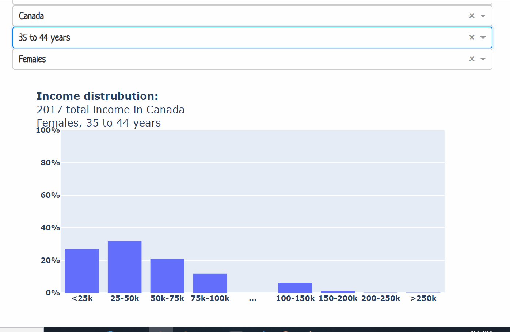
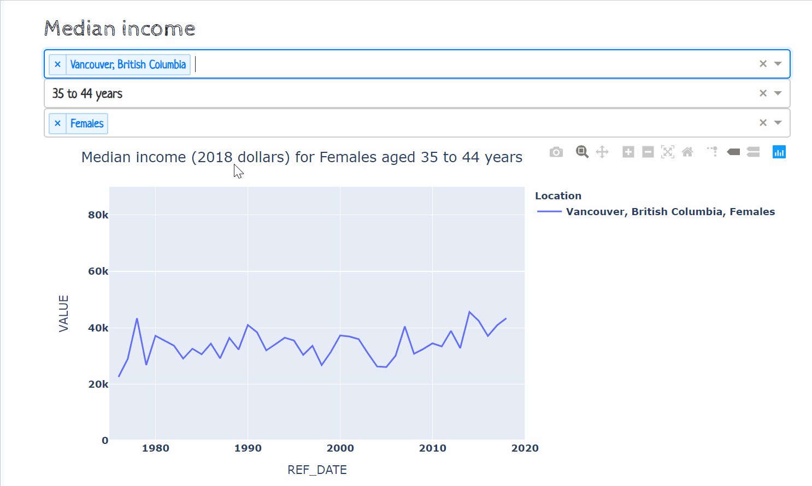

# Income distributions in Canada

## Summary
This repository was developed to explore total personal income statistics provided by Statistics Canada.  The main result is a [Dash](https://plotly.com/dash/) application which can be found [here](https://canadian-income-statistics.herokuapp.com/page-3).




The income statistics are based on total personal income (line X of a Canadian income tax return) from the following tables:
- [Tax filers and dependants with income by total income, sex and age](https://doi.org/10.25318/1110000801-eng).
- [Income of individuals by age group, sex and income source, Canada, provinces and selected census metropolitan areas](https://doi.org/10.25318/1110023901-eng)

## How to run the application locally

To run the dash application locally, you can clone the repo and install the dependencies:
```
git clone https://github.com/BlaneG/CAN-income-stats.git
cd CAN-income-stats
pip install requirements.txt
```

Run the application with:
```
python index.py
```

